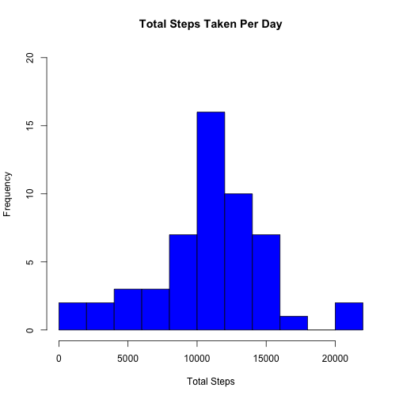
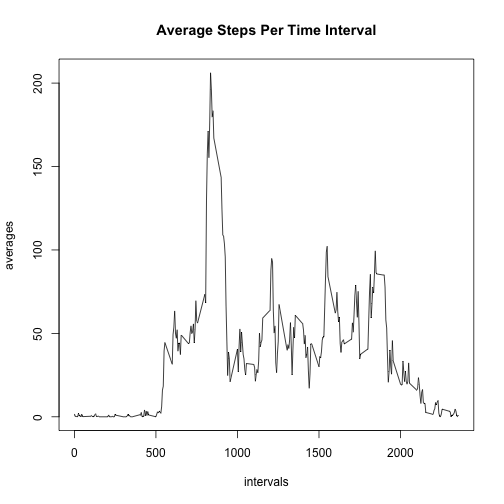
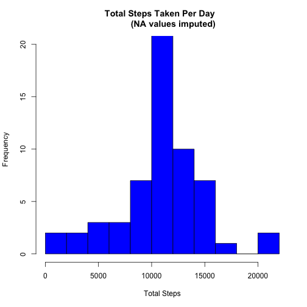
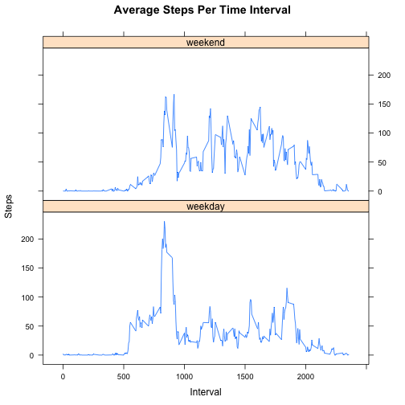

# Introduction

Start by reading in the file and remove any NA values:


```r
activity <- read.csv("activity.csv", header = TRUE)
activity_relevant <- activity[!is.na(activity$steps), ]
```

# What is the mean total number of steps taken per day?

Calculate the average number of steps taken per day and make a histogram:

```r
total_activity <- aggregate(activity_relevant$steps, FUN = sum, 
                            by = list(activity_relevant$date))
names(total_activity) <- c("Date", "Steps")
mean_steps <- mean(total_activity$Steps)
mean_steps <- format(round(mean_steps, 2), nsmall = 2)
median_steps <- median(total_activity$Steps)
hist(total_activity$Steps, breaks = 15, main = "Total Steps Taken Per Day", 
     xlab = "Total Steps", col = "blue", ylim = c(0, 20))
```


  
**The mean number of steps taken per day was 10766.19.**  
**The median number of steps taken per day was 10765.**

# What is the average daily activity pattern?

Find the average steps for each time interval taken across all days and plot

```r
averages <- tapply(activity_relevant$steps, activity_relevant$interval, mean)
intervals <- as.numeric(names(averages))
plot(intervals, averages, type = "l", main = "Average Steps Per Time Interval")
```



Determine which interval had the maximum average steps

```r
maximum <- intervals[which.max(averages)]
```
**The maximum average number of steps occurs at interval 835.**

# Imputing Missing Values

We previously filtered out all of the missing NA values.  
Let's see how many NA values the original dataset had.

```r
numberNAs <- nrow(activity) - nrow(activity_relevant)
```
There were 2304 NA values for "steps" in the original dataset.

We need to impute the NA values and create a new dataset with the NAs filled in.
NAs will be imputed with the average value for that interval across all days:

```r
for (i in 1:length(activity$steps)){
        if(is.na(activity$steps[i])){
                interval <- activity$interval[i]
                index <- which(intervals == interval)
                activity$steps[i] <- averages[index]
        }
}
```

Make a histogram of the total number of steps taken each day. Calculate the
mean and median number of steps taken per day.

```r
total_activity2 <- aggregate(activity$steps, by = list(activity$date), FUN = sum)
names(total_activity2) <- c("Date", "Steps")
mean_steps2 <- mean(total_activity2$Steps)
mean_steps2 <- format(round(mean_steps2, 2), nsmall = 2)
median_steps2 <- median(total_activity2$Steps)
median_steps2 <- format(round(median_steps2, 2), nsmall = 2)
hist(total_activity2$Steps, breaks = 15, main = "Total Steps Taken Per Day  
         (NA values imputed)", xlab = "Total Steps", col = "blue", ylim = c(0, 20))
```



**The mean number of steps taken per day was 10766.19.**  
**The median number of steps taken per day was 10766.19.**  
*Note that decimals were introduced when the values were imputed.*  
In this particular case, imputing values had almost no effect on the mean
and median number of steps taken per day.

# Are there differences in activity patterns between weekdays and weekends?
Start by adding a "Weekday" factor to the data set. Using label **3** for clarity
since previous steps used label **2**

```r
activity3 <- activity
weekday <- weekdays(as.POSIXct(activity3$date))
weekday <- factor(ifelse(weekday != "Saturday" & weekday != "Sunday", 
              "weekday", "weekend"))
activity3 <- cbind(activity3, weekday)
```

Average the data for each interval across all days

```r
activity3 <- split(activity3, activity3$weekday)
activity3$weekday <- aggregate(activity3$weekday$steps, 
                               by = list(activity3$weekday$interval), FUN = mean)
activity3$weekend <- aggregate(activity3$weekend$steps,
                               by = list(activity3$weekend$interval), FUN = mean)
activity3$weekday <- cbind(activity3$weekday, 
                           factor(rep("weekday", length(activity3$weekday))))
activity3$weekend <- cbind(activity3$weekend, 
                           factor(rep("weekend", length(activity3$weekend))))
names(activity3$weekday) <- c("interval", "steps", "weekday")
names(activity3$weekend) <- c("interval", "steps", "weekday")
activity3 <- rbind(activity3$weekday, activity3$weekend)
```

Now plot the data by weekday and weekend

```r
library(lattice)
xyplot(activity3$steps ~ activity3$interval | activity3$weekday, type = "l",
       main = "Average Steps Per Time Interval", xlab = "Interval",
       ylab = "Steps", layout = c(1, 2))
```


